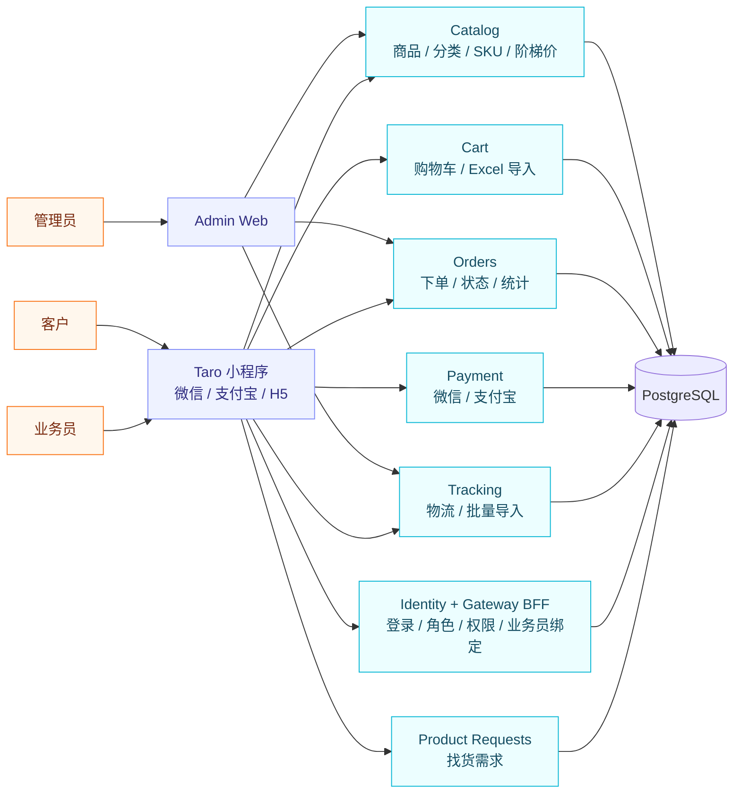
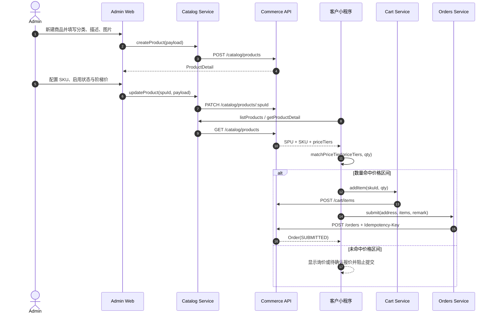
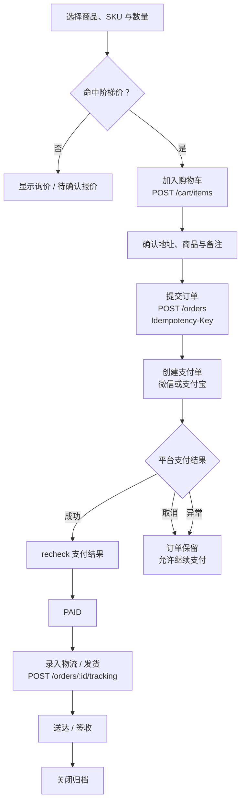
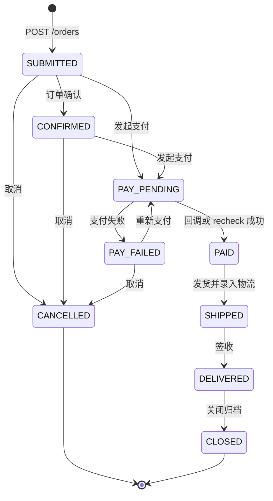
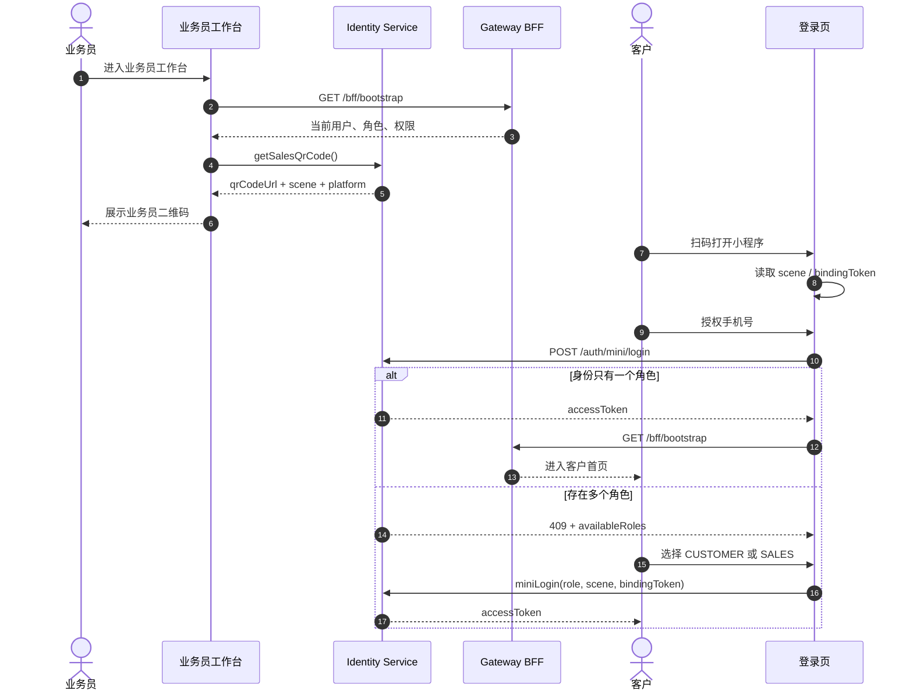
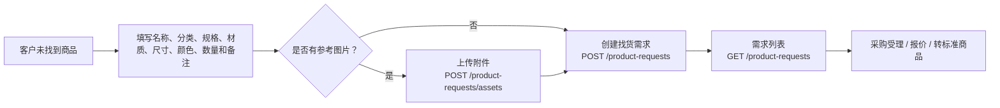

# tmo-monorepo

本仓库用于统一协作者与 agent 的工具链约定与协作方式。

## 版本策略
- 语言与工具版本不写死，默认使用 stable 或 stable LTS。
- 若仓库已有配置（如 `go.work`、`pnpm-workspace.yaml`、各应用 `package.json`），以其为准。

## 项目结构
- `apps/miniapp/`：小程序（业务逻辑统一，Taro + React + TypeScript + Sass，可构建 WeChat/Alipay 等平台）
- `apps/admin-web/`：后台管理控制台（预留）
- `services/`：后端服务（Go）
- `contracts/openapi/`：API 合约（OpenAPI）
- `docs/`：agent-first 文档入口，按 `context/`、`runbooks/`、`decisions/`、`execplans/` 分层（见 `docs/README.md`）
- `infra/`：本地基础设施与环境

## 工具链总览（按 commerce 服务对齐）
### 后端
- 语言与框架：Go、Gin
- 基础设施：PostgreSQL、Redis、Nginx（本地 Postgres 见 `infra/dev/docker-compose.yml`）
- API 合约：OpenAPI（`contracts/openapi/*.yaml`）
- API 生成：oapi-codegen（生成到 `services/commerce/internal/http/oapi`，生成文件不手改）
- 核心依赖：oapi-codegen/runtime、google/uuid
- 数据访问：pgx/v5、sqlc（`services/commerce/sqlc.yaml`）
- 迁移工具：goose（`services/commerce/migrations`）
- 测试：Go testing/httptest；`go test`（覆盖率/竞态/fuzz）、`go tool cover`，统一入口 `tools/scripts/test-backend.sh` 或 `pnpm run test:backend`
- 静态检查：gofmt、golangci-lint（`./.golangci.yml` 启用 govet/errcheck/staticcheck/ineffassign/unused/misspell/unconvert/gocritic/prealloc/bodyclose/nilerr/gosec）

### 前端
- 框架：Taro CLI + React + TypeScript + Sass
- 构建与开发：`apps/miniapp` 的 Taro scripts（如 `dev:weapp`、`dev:alipay`）
- 平台产物目录：`apps/miniapp/dist/weapp`（微信）与 `apps/miniapp/dist/alipay`（支付宝），请分别导入对应开发者工具
- 微信联调前置：请在 `apps/miniapp/.env.development` 设置 `TARO_APP_ID` 为真实小程序 AppID，`touristappid` 仅用于游客预览
- 静态检查：ESLint（taro config）、Stylelint（standard）
- 包管理：pnpm workspace

## 协作与 Agent 约定
- 新增/替换工具链需先与负责人确认，并更新本 README。
- 需求不明确时，Agent 先使用 `ask-questions-if-underspecified` 澄清，再开始实现。
- 生成目录与迁移文件按工具规范维护（sqlc/goose/oapi-codegen）。
- 涉及仓库文档时，先从 `docs/README.md` 进入，再按文档职责选择维护位置，避免继续向 `docs/` 根目录堆放散文件。

## 常用命令
```bash
pnpm install
pnpm -C apps/miniapp build:weapp
pnpm -C apps/miniapp build:alipay
pnpm -C apps/miniapp dev:weapp
pnpm -C apps/miniapp dev:alipay
pnpm run dev:admin-web:mock
pnpm run dev:admin-web:real
pnpm run dev:admin-web:stack
pnpm run smoke:admin-web
pnpm run test:backend
make db-up
make db-down
make dev-stack-up
make dev-stack-up-air
make dev-stack-down-air
make identity-seed-check
make identity-repair
```

后端 Air 开发容器：
- `make dev-stack-up-air`：启动 Postgres + backend 全栈，Go 服务运行在容器内并由 Air 托管热更新。
- `make dev-stack-down-air`：关闭 Air 开发容器栈。
- `bash tools/scripts/dev-air-switch.sh /absolute/path/to/worktree`：把 Air 开发容器整栈切换到指定 git worktree，只会 `force-recreate` 容器，不会重建 image。
- 对协作者与 agents 的约定：当目标是“切到另一个 worktree/分支继续 Air 热更新”时，优先使用 `dev-air-switch.sh`；不要默认执行 `DEV_STACK_BUILD_IMAGES=true make dev-stack-up-air`，除非确实需要重建 image。
- 若需查看 Air 重编译日志，可执行：
  `docker compose -f infra/dev/docker-compose.yml -f infra/dev/docker-compose.backend.yml -f infra/dev/docker-compose.dev.yml logs -f identity commerce payment gateway-bff`
- 当前方案仅支持“整栈一起切到同一个 worktree”；不支持每个服务绑定不同 worktree。

稳定 Docker 联调（推荐）：
- `make dev-stack-up` 默认会为容器构建与 Air 运行时注入稳定的 Go 模块参数：
  - `DEV_STACK_GOPROXY=https://goproxy.cn,direct`
  - `DEV_STACK_GOSUMDB=off`
  - `DEV_STACK_GONOSUMDB=*`
- 如需覆盖，可在命令前显式设置（例如恢复官方 proxy）：
  `DEV_STACK_GOPROXY=https://proxy.golang.org,direct DEV_STACK_GOSUMDB=sum.golang.org DEV_STACK_GONOSUMDB= make dev-stack-up`
- 栈启动后可执行：`bash tools/scripts/dev-stack-health.sh` 验证 `/ready`、`/health` 与网关业务接口联通性。
- 如需验证或修复 admin-web real 登录基线，可执行：
  `make identity-seed-check`
  `make identity-repair`
- 若构建报 `no space left on device`，先执行 `docker system df` 与 `docker builder prune -f` 再重试。

miniapp 编译产物目录：
- 微信：`apps/miniapp/dist/weapp`
- 支付宝：`apps/miniapp/dist/alipay`
## 核心业务链路

以下流程图按当前前端 service、OpenAPI 合约与后端服务边界整理，便于产品、前端、后端和测试共同核对业务闭环。

### 系统业务全景



### Admin 建品到客户下单



### 下单、支付与履约



### 订单状态机



订单主状态为 `SUBMITTED / CONFIRMED / PAY_PENDING / PAID / PAY_FAILED / SHIPPED / DELIVERED / CANCELLED / CLOSED`；支付状态独立维护为 `UNPAID / PAY_PENDING / PAID / PAY_FAILED`。

### 业务员获客与角色链路



业务员工作台包含主页、客户、订单和财务四个视图。业务员二维码与扫码登录绑定使用 Identity API；客户归属、订单归因、销售业绩和佣金结算应由服务端数据驱动，禁止在生产模式依赖静态 mock。

### 找不到商品时的需求单



### 主要前端函数与 API

| 业务 | 前端函数 | API |
| --- | --- | --- |
| 商品 | `catalog.createProduct` | `POST /catalog/products` |
| 商品 | `catalog.updateProduct` | `PATCH /catalog/products/:spuId` |
| 商品 | `catalog.getProductDetail` | `GET /catalog/products/:spuId` |
| 购物车 | `cart.addItem / updateItemQty / removeItem` | `POST/PATCH/DELETE /cart/items` |
| 下单 | `orders.submit` | `POST /orders` |
| 支付 | `paymentServices.sessions.payForOrder` | `POST /payments/{wechat\|alipay}/create` |
| 支付确认 | `paymentServices.sessions.recheck` | `POST /payments/:paymentId/recheck` |
| 物流 | `tracking.getTracking / updateTracking` | `GET/POST /orders/:orderId/tracking` |
| 业务员二维码 | `identityServices.me.getSalesQrCode` | `GET /me/sales-qr-code` |
| 找货需求 | `productRequests.create` | `POST /product-requests` |
